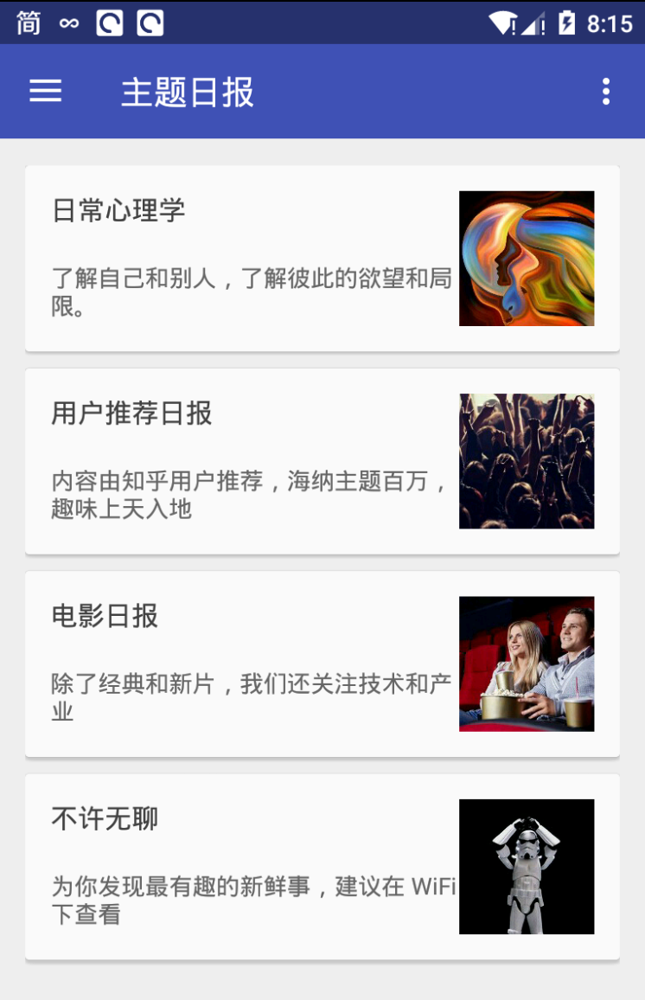

# ZhiHuDaily
#### 个人项目 

这是仿知乎日报的一个APP, 使用了知乎日报的 API, 网络框架部分使用了 Retrofit+RxJava+OkHttp, 仅供交流使用.

该项目还没在继续完善，所以就暂不放出 apk 下载了.

## Features

- 首页三大模块， 最新消息， 主题日报， 栏目总览的实现。
- 最新消息模块和主题日报模块的数据由知乎日报 API 提供。
- 栏目总览在原知乎日报没有发现，也一并写进去了。
- 文章详情的实现，文章信息都是 html 格式的，用WebView实现，添加了Css的支持，因为 WebView 是不支持滑动监听的，便自定义了支持滑动监听的 ScrollWebView。
- 使用Retrofit + RxJava + OkHttp网络框架。
- 添加阅读进度记录的功能，首页显示上一次阅读过没读完的文章，支持跳转到上次阅读到的地方。
- 过往消息模块的功能还没有正式写，晚些补上。
- 登录模块，待完善
- 编辑信息模块，待完善

## Screenshots

   

   

   

  

## Instructions

- 如果你有任何意见， bug， 问题都可以给我提 Issue， 我会第一时间关注并解决
- 后期会抽时间使用 MVP 来重构整个项目，让整体架构更清晰。

## Statement

该项目仅供交流学习使用， 如果该项目有侵犯知乎日报版权问题，本人会及时删除此页面与整个项目。

## Thanks to the open source project

- [okhttp](https://github.com/square/okhttp)
- [RxJava](https://github.com/ReactiveX/RxJava)
- [retrofit](https://github.com/square/retrofit)
- [ConvenientBanner](https://github.com/saiwu-bigkoo/Android-ConvenientBanner)
- [CircleImageView](https://github.com/hdodenhof/CircleImageView)
- [MarkdownView](https://github.com/falnatsheh/MarkdownView)

## About me

我是一名 Android 开发爱好者， 坐标广州， 目前大三。

#### End